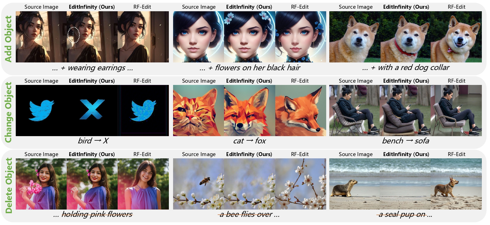

# EditInfinity: Image Editing with Binary-Quantized Generative Models

<p align="center">

<br>
EditInfinity excels in background preservation, text alignment.
</p>

## 🔥 Updates!!
* Sep 22, 2025: 🤗 Code release
* Sep 18, 2025: 🌺 EditInfinity is accepted as NeurIPS 2025 Poster

## 📑 Open-Source Plan
  - We will complete the organization of this code repository by October 24, 2025. Stay tuned.

## ✨ Quick Start
### 1. Download weights
Download [flan-t5-xl](https://huggingface.co/google/flan-t5-xl), [`infinity_2b_reg.pth`](https://huggingface.co/FoundationVision/Infinity/tree/main) and [`infinity_vae_d32reg.pth`](https://huggingface.co/FoundationVision/Infinity/tree/main) files to weights folder.
### 2. Run the three editing cases we have prepared
We have prepared three different editing cases:

#### Case 1: Full Image Editing (No Background Preservation)
- **Script Path**: `./example_case/example_1/scripts/edit_pipeline.sh`
- **Description**: This case does not involve background preservation and performs editing on the entire image. Note that you need to set the relative path `./EditInfinity/`
**Execution Command:**
```bash
bash example_case/example_1/scripts/edit_pipeline.sh
```
This command will automatically complete the text embedding, LoRA training, and inference pipeline sequentially.
- **Parameter Configuration**: In the `./example_case/example_1/scripts/edit_pipeline.sh` script, you can freely choose whether to enable text embedding and LoRA training, as well as set the number of training iterations. During inference, you can also choose whether to use text embedding and LoRA training results with corresponding iteration numbers. Text embedding training for 10 iterations and LoRA training for 30 iterations are empirical choices, but we strongly recommend trying different iteration numbers as they may yield better results.

#### Case 2: Background Preservation Editing (Requires User-Provided Mask)
- **Script Path**: `./example_case/example_2/scripts/edit_pipeline.sh`
- **Description**: This case involves background preservation operations and requires users to provide a background mask image.
**Execution Command:**
```bash
bash example_case/example_2/scripts/edit_pipeline.sh
```
This command will automatically complete the entire editing pipeline.
- **Parameter Configuration**: Similar to Case 1, you can freely set desired parameters in the `./example_case/example_2/scripts/edit_pipeline.sh` script without modifying other code files.

#### Case 3: Background Preservation Editing (Automatic Mask Segmentation)
- **Script Path**: `./example_case/example_3/scripts/edit_pipeline.sh`
- **Description**: This case involves background preservation operations but does not require users to provide a background mask image. The model will automatically segment the mask image for the target word based on the provided `./example_case/example_3/prompt/target_word.txt` and the threshold specified in `./example_case/example_3/scripts/get_weighted_tensor.sh`. Threshold=0.5 is an empirical choice, but you can adjust the threshold value based on the segmentation results to automatically obtain a better mask image.
**Execution Command:**
```bash
bash example_case/example_3/scripts/edit_pipeline.sh
```
This command will automatically complete the entire editing pipeline.
- **Parameter Configuration**: As before, you can freely set desired parameters in the `./example_case/example_3/scripts/edit_pipeline.sh` script without modifying other code files.
  
## 📖 Citation
If our work assists your research, feel free to give us a star ⭐ or cite us using:

```
@misc{EditInfinity,
    title={EditInfinity: Image Editing with Binary-Quantized Generative Models}, 
    author={Jiahuan Wang and Yuxin Chen and Jun Yu and Guangming Lu and Wenjie Pei},
    year={2025},
    eprint={},
    archivePrefix={},
    primaryClass={},
    url={}, 
}
```

## 🍭 Acknowledgement
Our work is built upon the foundation of [Infinity](https://github.com/FoundationVision/Infinity/tree/main).We thank them for their excellent work.
