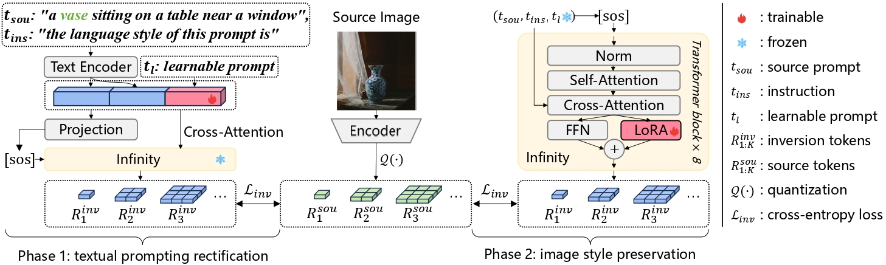
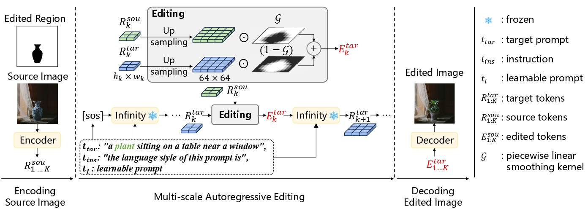
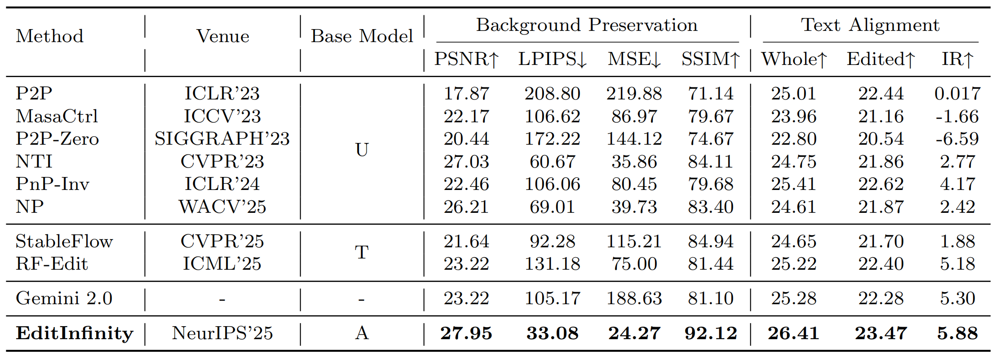
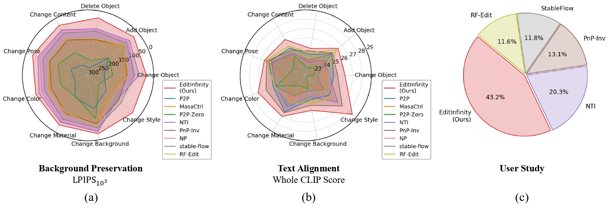
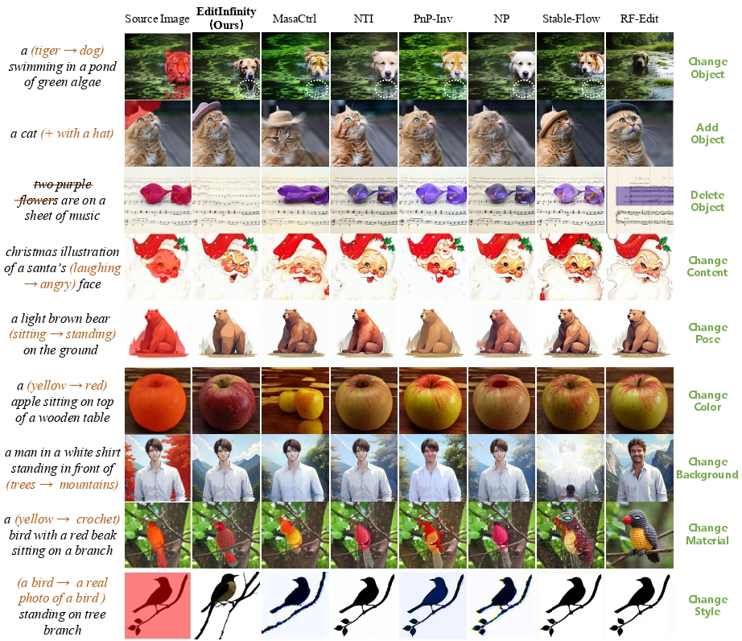
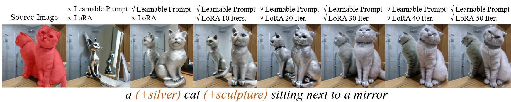

# EditInfinity: Image Editing with Binary-Quantized Generative Models

<div align="center">

[](https://arxiv.org/abs/2510.20217)&nbsp;

</div>

<p align="center">

<br>
EditInfinity excels in background preservation, text alignment.
</p>

## 🔥🔥🔥 If you encounter any problems with the paper or code reproduction, feel free to submit an issue. 
* Alternatively, you can also reach me at ychenqa@connect.ust.hk 

## 🚀 Updates!!
* Oct 24, 2025: 🍉 Paper release
* Sep 22, 2025: 🤗 Code release
* Sep 18, 2025: 🎉 EditInfinity is accepted to NeurIPS 2025!

## 📖 Introduction
  - We present EditInfinity, a parameter-efficient image editing method built upon the classical "image inversion-image editing" adaptation paradigm and applied to Infinity—a leading binary-quantized generative model. 
  - EditInfinity incorporates an efficient yet powerful image inversion mechanism that integrates text prompt rectification and image style preservation, leveraging quantized representations as precise supervisory signals to achieve high-fidelity image reconstruction. Furthermore, a holistic smoothing strategy is devised to ensure that the edited results retain strong structural fidelity to the source image while maintaining accurate semantic alignment with the target text prompt.
  - Extensive experiments conducted on the PIE-Bench benchmark demonstrate that EditInfinity significantly outperforms state-of-the-art diffusion-based approaches across a variety of editing operations. It excels particularly in background preservation and semantic consistency with the target text, showcasing robust and superior editing performance.

### 🔥 Image Inversion with Exact Supervision:

<p align="center">
  
</p>

Given a source image $I_{sou}$ and its prompt $t_{sou}$, the inversion process follows these steps:
1. First, we quantize $I_{sou}$ into exact tokens $R_{1...K}^{sou}$.
2. Then, we concatenate $t_{sou}$ with an instruction $t_{ins}$ and a learnable prompt $t_l$ — where $t_l$ is optimized via &#x2112;<sub>inv</sub> under the supervision of $R_{1...K}^{sou}$.
3. Afterwards, the prompt is frozen, and LoRA is applied to the FFN layers of Infinity to further reconstruct $I_{sou}$.

### 🔥 Image Editing with Holistic Smoothing:

<p align="center">
  
<p>

Given a source image and target editing requirements, the process follows these steps:
1. First, we encode the source image into tokens $R_{1...K}^{sou}$.
2. Then, at each step $k$ of autoregressive generation, the generated $R_k^{tar}$ is conditioned on the concatenation of the target prompt $t_{tar}$, instruction $t_{ins}$, and optimized learnable prompt $t_l$. It is then blended with $R_k^{sou}$ under the guidance of the piecewise linear smoothing kernel $\mathcal{G}$, forming edited tokens $E_k^{tar}$ to prepare for guiding the next-scale generation.
3. Finally, $E_{1...K}^{tar}$ is decoded into the edited image.

### 🔥 Quantitative Results on PIE-Bench:

<p align="center">


<br>
Quantitative results on PIE-Bench.
<p>
  
### 🔥 Qualitative Results on PIE-Bench:

<p align="center">

<br>
Qualitative results on PIE-Bench across all nine tasks.
<p>


## 🏐 Environment Setup
This project requires **PyTorch ≥ 2.5.1** because we use **FlashAttention** to accelerate training.
### 1. Install PyTorch (required)
Make sure to install a PyTorch version ≥ 2.5.1 that is compatible with FlashAttention.
Example for **CUDA Toolkit 11.8**:
```bash
pip install torch==2.5.1+cu118 torchvision==0.20.1+cu118 torchaudio==2.5.1+cu118 --index-url https://download.pytorch.org/whl/cu118
```
### 2. Install other dependencies
```bash
pip install -r requirements.txt
```
### 3. Install FlashAttention
Download a matching prebuilt wheel from the official release page:
👉 [FlashAttention Releases](https://github.com/Dao-AILab/flash-attention/releases/)
You must choose a wheel that matches:
* Your **CUDA** version
* Your **PyTorch** version
* Your **Python** version
#### Example (CUDA 11.8 + PyTorch 2.5.1 + Python 3.10)
From release page (e.g., [v2.7.3](https://github.com/Dao-AILab/flash-attention/releases/tag/v2.7.3)), download:
```
flash_attn-2.7.3+cu11torch2.5cxx11abiFALSE-cp310-cp310-linux_x86_64.whl
```
Then install it:
```bash
pip install flash_attn-2.7.3+cu11torch2.5cxx11abiFALSE-cp310-cp310-linux_x86_64.whl
```
### Full Installation Example (Recommended)
Example using **CUDA Toolkit 11.8**:
```bash
conda create -n EditInfinity python=3.10
conda activate EditInfinity
```
1. Install PyTorch:
```bash
pip install torch==2.5.1+cu118 torchvision==0.20.1+cu118 torchaudio==2.5.1+cu118 --index-url https://download.pytorch.org/whl/cu118
```
2. Install project dependencies:
```bash
pip install -r requirements.txt
```
3. Install FlashAttention:
```bash
pip install flash_attn-2.7.3+cu11torch2.5cxx11abiFALSE-cp310-cp310-linux_x86_64.whl
```

## ⚾️ Pretrain-Weights Setup
Download weights from huggingface to weights folder:
1. Download [flan-t5-xl](https://huggingface.co/google/flan-t5-xl)
2. Download [`infinity_2b_reg.pth`](https://huggingface.co/FoundationVision/Infinity/tree/main)
3. Download [`infinity_vae_d32reg.pth`](https://huggingface.co/FoundationVision/Infinity/tree/main) 
### Full Weights Installation Example (Recommended)
```bash
cd ./EditInfinity
mkdir weights
huggingface-cli download google/flan-t5-xl --local-dir ./weights/flan-t5-xl --local-dir-use-symlinks False
huggingface-cli download FoundationVision/Infinity --include infinity_2b_reg.pth --local-dir ./weights --local-dir-use-symlinks False
huggingface-cli download FoundationVision/Infinity --include infinity_vae_d32reg.pth --local-dir ./weights --local-dir-use-symlinks False
```
   
## 🕹️ Quick Start
### Run the three editing cases we have prepared

#### Case 1: Full Image Editing (No Background Preservation)
- **Script Path**: `./example_case/example_1/scripts/edit_pipeline.sh`
- **Description**: This case does not involve background preservation and performs editing on the entire image. Note that you need to set the relative path `./EditInfinity/`
- **Execution Command:**
  First, you need to modify the export PYTHONPATH=$PYTHONPATH:"" line in the ./example_case/example_1/scripts/edit_pipeline.sh file to the correct relative path. For example, set it to:  export PYTHONPATH=$PYTHONPATH:/project/EditInfinity  
After making this change, you can directly execute the following command:
  ```bash
  bash example_case/example_1/scripts/edit_pipeline.sh
  ```
  This command will automatically complete the text embedding, LoRA training, and inference pipeline sequentially.
- **Parameter Configuration**: In the `./example_case/example_1/scripts/edit_pipeline.sh` script, you can freely choose whether to enable text embedding and LoRA training, as well as set the number of training iterations. During inference, you can also choose whether to use text embedding and LoRA training results with corresponding iteration numbers. Text embedding training for 10 iterations and LoRA training for 20 iterations are empirical choices, but we strongly recommend trying different iteration numbers as they may yield better results.

<p align="center">

<br>
Illustrations of ablating the Learnable Prompt and LoRA.
<p>

#### Case 2: Background Preservation Editing (Requires User-Provided Mask)
- **Script Path**: `./example_case/example_2/scripts/edit_pipeline.sh`
- **Description**: This case involves background preservation operations and requires users to provide a background mask image.
- **Execution Command:**
  ```bash
  bash example_case/example_2/scripts/edit_pipeline.sh
  ```
  This command will automatically complete the entire editing pipeline.
- **Parameter Configuration**: Similar to Case 1, you can freely set desired parameters in the `./example_case/example_2/scripts/edit_pipeline.sh` script without modifying other code files.

#### Case 3: Background Preservation Editing (Automatic Mask Segmentation)
- **Script Path**: `./example_case/example_3/scripts/edit_pipeline.sh`
- **Description**: This case involves background preservation operations but does not require users to provide a background mask image. The model will automatically segment the mask image for the target word based on the provided `./example_case/example_3/prompt/target_word.txt` and the threshold specified in `./example_case/example_3/scripts/get_weighted_tensor.sh`. Threshold=0.5 is an empirical choice, but you can adjust the threshold value based on the segmentation results to automatically obtain a better mask image.
- **Execution Command:**
  ```bash
  bash example_case/example_3/scripts/edit_pipeline.sh
  ```
  This command will automatically complete the entire editing pipeline.
- **Parameter Configuration**: As before, you can freely set desired parameters in the `./example_case/example_3/scripts/edit_pipeline.sh` script without modifying other code files.
  
## 📖 Citation
If our work assists your research, feel free to give us a star ⭐ or cite us using:

```
@misc{EditInfinity,
    title={EditInfinity: Image Editing with Binary-Quantized Generative Models}, 
    author={Jiahuan Wang and Yuxin Chen and Jun Yu and Guangming Lu and Wenjie Pei},
    year={2025},
    eprint={2510.20217},
    archivePrefix={arXiv},
    primaryClass={cs.CV},
    url={https://arxiv.org/abs/2510.20217}, 
}
```

## 🍭 Acknowledgement
Our work is built upon the foundation of [Infinity](https://github.com/FoundationVision/Infinity/tree/main).Thank them for their excellent work.
